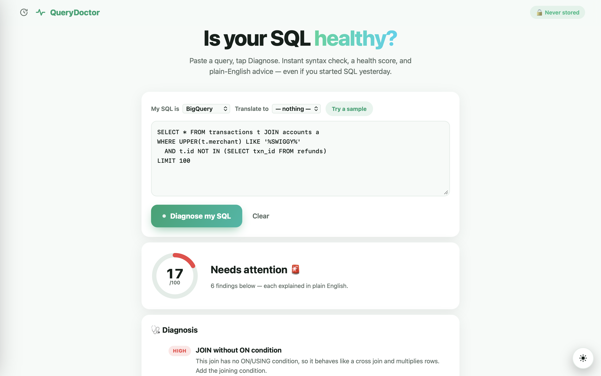
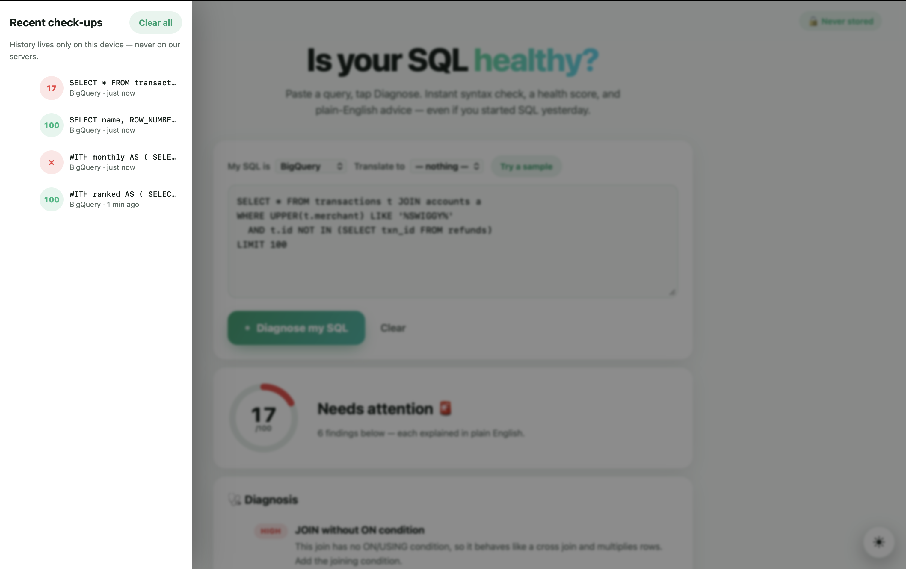

# 🩺 QueryDoctor

**Is your SQL healthy? Instant check-up, plain-English diagnosis.**

[](https://github.com/ARAVINDHRAJA123/querydoctor/actions)
[](https://querydoctor-616665622891.asia-south1.run.app)
[](#-supported-dialects)
[](#-how-it-works)

Paste SQL → tap **Diagnose** → get a syntax check, a 0–100 health score, and advice
anyone can follow — even if you started learning SQL yesterday.

**🔗 Try it now: https://querydoctor-616665622891.asia-south1.run.app**

---

## ✨ What it does

| | Feature |
|---|---|
| 🚑 | **Syntax check with typo hints** — `SELCT …` → *"'SELCT' isn't a SQL command — did you mean SELECT?"*, plus a caret pointing at the exact failing column |
| 💯 | **Health score (0–100)** — animated ring, weighted by finding severity |
| 🩹 | **9 lint rules in plain English** — `DELETE` without `WHERE`, joins without `ON`, `SELECT *`, `LIMIT` without `ORDER BY`, `%…` LIKE patterns, the `NOT IN` + NULL trap, functions that kill partition pruning, `UNION` vs `UNION ALL` |
| ✨ | **Auto-formatting** — paste ugly SQL, copy back a clean version |
| 🚀 | **Optimizer suggestions** — deterministic sqlglot rewrites (constant folding, dead-predicate elimination: `WHERE 1=1 AND a > 2+3` → `WHERE a > 5`); cosmetic-only diffs are suppressed |
| 🔁 | **Dialect translation** — all 10×9 direction pairs verified (e.g. MySQL `IFNULL`/`GROUP_CONCAT` → BigQuery `COALESCE`/`STRING_AGG`) |
| 🕐 | **Check-up history** — Claude/ChatGPT-style drawer, stored only in your browser |
| 🌗 | **Dark / light mode** — circular-wipe transition, iOS-style springy buttons |
| 🔒 | **Private & abuse-proof** — SQL checked in memory, never stored; no accounts; per-IP rate limiting |

## 📸 Screenshots

| Diagnosis | History |
|---|---|
|  |  |

## ⚙️ How it works

No LLM, no API keys, no cost per check — the engine is [sqlglot](https://github.com/tobymao/sqlglot),
a pure-Python SQL parser/transpiler, plus hand-written lint rules over its AST:


**Tested like it matters:** the release battery runs 23 validity cases (including rare
features per dialect — `QUALIFY`, `LATERAL FLATTEN`, `CONNECT BY`, recursive CTEs, `MERGE`,
window frames) and **all 90 dialect-pair translations**, three consecutive runs, all green.

## 🗣 Supported dialects

BigQuery · PostgreSQL · MySQL · Snowflake · Spark SQL · SQLite · SQL Server (T-SQL) · Oracle · DuckDB · Redshift

## 🚀 Run locally

```bash
git clone https://github.com/ARAVINDHRAJA123/querydoctor.git
cd querydoctor
python3 -m venv venv && ./venv/bin/pip install -r requirements.txt
./venv/bin/uvicorn main:app --app-dir backend --port 8433
# open http://localhost:8433
```

## ☁️ Deploy your own (one command)

```bash
gcloud run deploy querydoctor --source . --region asia-south1 --allow-unauthenticated
```

## 📲 Install it like an app

| Platform | How |
|---|---|
| Android | Open the link in Chrome → tap **Install app** |
| iPhone | Safari → Share → **Add to Home Screen** |
| Windows / Mac | Chrome/Edge → install icon (⊕) in the address bar |

## 🧰 Stack

`Python` · `FastAPI` · `sqlglot` · `vanilla JS` · `PWA (manifest + service worker)` · `View Transitions API` · `Docker` · `Google Cloud Run`

---

Built by [Aravindhraja R](https://github.com/ARAVINDHRAJA123) · also see
[SpendStory](https://github.com/ARAVINDHRAJA123/spendstory) — your bank statement, decoded in seconds.
