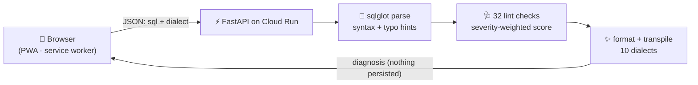

# 🩺 QueryDoctor

**Paste SQL, get a diagnosis: syntax errors with typo hints, a 32-check lint
pass, a 0–100 health score, and translation across 10 SQL dialects — all
without an LLM.**

[](https://github.com/ARAVINDHRAJA123/querydoctor/actions)
[](https://querydoctor-616665622891.asia-south1.run.app)
[](#-supported-dialects)
[](#-why-no-ai)
[](tests/)

**🔗 Try it now: https://querydoctor-616665622891.asia-south1.run.app**

---

## Example

**Input**
```sql
SELCT user_id, name, count(*) FROM orders GROUP BY user_id
```

**Output**
```
❌ Syntax Error — Line 1, Col 14
Invalid expression / Unexpected token
💡 'SELCT' isn't a SQL command — did you mean SELECT?
```

Fix the typo, run it again:

```
💯 Health Score: 70/100

🩹 Selected column missing from GROUP BY   (high, -30)
   'name' is selected but not aggregated or listed in GROUP BY. Most
   engines reject this outright; some (like older MySQL) silently pick
   an arbitrary row's value — add it to GROUP BY or wrap it in an
   aggregate.
```

## ✨ What it does

| Capability | Description |
|---|---|
| 🚑 Syntax diagnosis | Parser errors with typo hints (`SELCT` → *did you mean SELECT?*) and a caret at the exact failing column |
| 💯 Health score | 0–100, severity-weighted — see [how it's scored](#-how-the-health-score-works) |
| 🩹 SQL linting | 32 AST-based rules plus a token-level missing-comma detector — see the full list below |
| ✨ Formatter | Paste ugly SQL, copy back a clean version |
| 🚀 Optimizer | Deterministic sqlglot rewrites (constant folding, dead-predicate elimination); cosmetic-only diffs are suppressed, and rewrites that would silently change results are suppressed too — see [below](#-a-note-on-the-optimizer-suggestion) |
| 🔁 Dialect translation | All 10×9 direction pairs verified (e.g. MySQL `IFNULL`/`GROUP_CONCAT` → BigQuery `COALESCE`/`STRING_AGG`) |
| 🕐 Check-up history | Local-only drawer, stored in your browser |
| 🌗 Dark / light mode | Circular-wipe transition |
| 🔒 Privacy | SQL checked in memory, never stored; no accounts |
| 🤖 GitHub Action | Lints changed `.sql` files on every PR ([setup](#-use-it-as-a-github-action)) |

### The 32 lint checks

`DELETE`/`UPDATE` without `WHERE` · `CROSS JOIN` · join without `ON`/`USING` ·
`SELECT *` · `LIMIT` without `ORDER BY` · leading-`%` `LIKE` patterns ·
`NOT IN` + subquery (the NULL trap) · function wrapped around a column in
`WHERE` (kills index/partition pruning) · `UNION` vs `UNION ALL` · `HAVING`
used without an aggregate (should be `WHERE`) · selected column missing from
`GROUP BY` · `ORDER BY` inside a subquery/CTE without `LIMIT` · `CASE` without
`ELSE` · `JOIN ON 1=1`/`ON true` (Cartesian product) · `COALESCE` inside an
equality comparison · `ROW_NUMBER`/`LAG`/`LEAD` without `ORDER BY` · `INSERT`
without an explicit column list · `WHERE` clause silently nullifying an
outer join (`LEFT`/`RIGHT`/`FULL`) — filtering on the optional side turns
it into an `INNER JOIN` · `BETWEEN` with bare date literals (silently
excludes time-of-day on the end date) · `ORDER BY` by column position ·
scalar subquery in the `SELECT` list without `LIMIT 1` · `UPDATE ... FROM`
with no condition linking the two tables (a cross-join update) · an
aggregate mixed with a plain column and no `GROUP BY` (most engines reject
this outright at execution time) · an aggregate function wrapping a window
function (`SUM(AVG(x) OVER (...))`, rejected at execution time) · a likely
missing comma — two bare words with nothing between them, which SQL
happily parses as an implicit alias instead of raising a syntax error ·
`x = NULL`/`x != NULL` (always evaluates to NULL, silently returns zero
rows — use `IS [NOT] NULL`) · `OFFSET` without `ORDER BY` · mixed ordinal
and named columns in the same `GROUP BY`/`ORDER BY` · redundant `DISTINCT`
with `GROUP BY` · a CTE defined but never referenced · a joined table whose
columns are never used anywhere else in the query · an unqualified column
in a query joining 2+ tables (works today, breaks silently if a same-named
column is added to another table) · a column alias referenced inside its
own `OVER()` clause (not visible there, resolves wrong or errors).

## 💯 How the health score works

Every check starts at 100. Each lint finding subtracts a fixed amount based
on severity; a syntax error alone caps the check at "invalid" (no score).

| Severity | Penalty | Example |
|---|---|---|
| High | −30 | `DELETE` without `WHERE`, join with no condition, missing `GROUP BY` column |
| Medium | −12 | `SELECT *`, `LIMIT` without `ORDER BY`, `HAVING` without an aggregate |
| Low | −5 | `UNION` vs `UNION ALL`, function wrapped around a column in `WHERE`, `ORDER BY` in a subquery without `LIMIT` |

Findings are deduplicated by rule (each rule fires once per check), and the
score floors at 0.

## A note on the optimizer suggestion

The "Optimizer suggestion" card runs sqlglot's own rewrite engine, which is
usually safe (constant folding, dead-predicate elimination) — but for
certain correlated subqueries, sqlglot can produce a rewrite that silently
changes the query's results, not just its shape. Specifically: a subquery
that combines an equality correlation (e.g. matching on `department_id`)
with a *separate* comparison correlation (e.g. `salary > outer.salary`) can
get decorrelated incorrectly — confirmed two distinct ways: an aggregate's
comparison getting dropped and relocated into an unrelated outer filter, and
an `IN`/`NOT IN` subquery's equality-target and comparison getting
decomposed into independent checks that no longer require the same
underlying row to satisfy both (verified with concrete sample data, not
just hypothetically). `EXISTS`/`NOT EXISTS` don't have this problem and are
still optimized normally. QueryDoctor detects this shape structurally and
skips the optimizer for it entirely, rather than risk showing a "cleaner"
query that quietly returns different rows.

## Limitations

Being upfront about what this doesn't do:

- No live database connection — doesn't validate that tables/columns actually exist
- No execution cost estimation (that's what [sql-review-agent](https://github.com/ARAVINDHRAJA123/sql-review-agent), the BigQuery-specific sibling project, is for)
- Dialect support is syntactic (via sqlglot), not semantic
- **dbt models**: raw `.sql` files under a dbt project (e.g. `models/**/*.sql`) contain Jinja — `{{ ref(...) }}`, `{{ source(...) }}`, `{{ config(...) }}`, macros — which sqlglot cannot parse directly. Enable `dbt-mode` (the Action's `dbt-mode: true` input, or `dbt_mode: true` on the `/api/check` request) to strip common Jinja constructs into placeholder SQL before linting. This is a **regex-based best-effort stub, not a real `dbt compile`** — it doesn't evaluate macros or resolve `ref()`/`source()` to real table names, so it catches structural SQL mistakes but not anything that depends on the actual rendered query. For that, run `dbt compile` and point QueryDoctor at `target/compiled/` instead
- Lint rules are structural pattern checks, not a full query optimizer — they catch common mistakes, not everything

## 📸 Screenshots

| Diagnosis | History |
|---|---|
|  |  |

## ⚙️ How it works

No LLM, no API keys, no cost per check — the engine is [sqlglot](https://github.com/tobymao/sqlglot),
a pure-Python SQL parser/transpiler, plus hand-written lint rules over its AST:



**Tested like it matters:** the release battery runs 23 validity cases (including rare
features per dialect — `QUALIFY`, `LATERAL FLATTEN`, `CONNECT BY`, recursive CTEs, `MERGE`,
window frames) and **all 90 dialect-pair translations**, three consecutive runs, all green.

## 🤖 Why no AI?

QueryDoctor intentionally uses deterministic parsing (sqlglot's AST) instead
of an LLM. That means: the same input always produces the same output, no
hallucinated fixes, no API keys or per-check cost, and latency measured in
milliseconds instead of seconds. The tradeoff is scope — it catches
structural mistakes, not "is this query semantically correct for my
business logic," which is exactly the line an LLM-based tool would blur.

## 📊 By the numbers

10 SQL dialects · 32 lint checks · 90 verified translation pairs · 201 tests passing

## 🗣 Supported dialects

BigQuery · PostgreSQL · MySQL · Snowflake · Spark SQL · SQLite · SQL Server (T-SQL) · Oracle · DuckDB · Redshift

## 🚀 Run locally

```bash
git clone https://github.com/ARAVINDHRAJA123/querydoctor.git
cd querydoctor
python3 -m venv venv && ./venv/bin/pip install -r requirements.txt
./venv/bin/uvicorn main:app --app-dir backend --port 8433
# open http://localhost:8433
```

## ☁️ Deploy your own (one command)

```bash
gcloud run deploy querydoctor --source . --region asia-south1 --allow-unauthenticated
```

## 🤖 Use it as a GitHub Action

Catch bad SQL in pull requests before it merges — no API keys, no per-repo
setup beyond one workflow file. On every PR, the action finds changed
`.sql` files, runs them through the same lint engine as the web app, and
posts (or updates) one comment with the findings. v1 is comment-only —
it never fails the check or blocks the merge.

```yaml
# .github/workflows/sql-review.yml
name: SQL Review
on: pull_request

jobs:
  review:
    runs-on: ubuntu-latest
    permissions:
      pull-requests: write   # needed to post/update the review comment
    steps:
      - uses: actions/checkout@v4
      - uses: ARAVINDHRAJA123/querydoctor@main
        with:
          dialect: bigquery          # optional, default: bigquery
          file-patterns: '**/*.sql'  # optional, comma-separated globs
          dbt-mode: 'true'           # optional, strip dbt/Jinja before linting
```

| Input | Default | Description |
|---|---|---|
| `github-token` | `${{ github.token }}` | Used to read the PR's changed files and post the comment. |
| `dialect` | `bigquery` | Any of the 10 supported dialects. |
| `file-patterns` | `**/*.sql` | Comma-separated glob(s) matched against changed file paths (e.g. `models/**/*.sql,dbt/**/*.sql`). |
| `dbt-mode` | `false` | Strips dbt/Jinja templating (`{{ ref(...) }}`, `{{ source(...) }}`, `{{ var(...) }}`, ``) before linting, so dbt model files don't false-positive as syntax errors. Best-effort regex stubbing — not a real `dbt compile`, so it won't catch errors that depend on the actual rendered SQL. |
| `api-key` | *(none)* | Paid tier only. Required for `fail-on-severity` to actually block a PR. Only the key is sent to the hosted API to check the license — your SQL is always linted locally and never leaves this workflow run. |
| `fail-on-severity` | *(none)* | Paid tier only. One of `low`/`medium`/`high` — with a valid `api-key`, the Action exits non-zero (failing the check, not just commenting) when a finding meets or exceeds this severity. |

### Paid tier

Everything above is free forever. The paid tier adds one thing: `fail-on-severity`
that actually blocks the merge instead of just leaving a comment.

Get a key on [the live app](https://querydoctor-616665622891.asia-south1.run.app)
(Razorpay checkout, ₹499/month or ₹4,999/year — shown once at purchase,
so save it as a repo secret right away):

```yaml
      - uses: ARAVINDHRAJA123/querydoctor@main
        with:
          api-key: ${{ secrets.QUERYDOCTOR_API_KEY }}
          fail-on-severity: high
```

## 🔌 Use it as an MCP server

Give any MCP client (Claude Code, Claude Desktop, Cursor, etc.) a `lint_sql`
tool so it can check SQL mid-conversation without shelling out or calling an
LLM for it. Same `lint_engine.py` the web app and GitHub Action use — no
network calls, no credentials, nothing stored.

```json
{
  "mcpServers": {
    "querydoctor": {
      "command": "python3",
      "args": ["/path/to/querydoctor/mcp_server/server.py"]
    }
  }
}
```

```bash
pip install -r mcp_server/requirements.txt
```

Exposes two tools: `lint_sql(sql, dialect, target_dialect, dbt_mode)` — the
full diagnosis (syntax, score, findings, formatted SQL, optimized rewrite,
translation) as structured JSON — and `list_dialects()`.

## 📲 Install it like an app

| Platform | How |
|---|---|
| Android | Open the link in Chrome → tap **Install app** |
| iPhone | Safari → Share → **Add to Home Screen** |
| Windows / Mac | Chrome/Edge → install icon (⊕) in the address bar |

## Use cases

Learning SQL · interview prep · cross-database migration · ETL/dbt model
review · code review before a PR merges · onboarding a team onto a new SQL
dialect.

## 🧰 Stack

`Python` · `FastAPI` · `sqlglot` · `vanilla JS` · `PWA (manifest + service worker)` · `View Transitions API` · `Docker` · `Google Cloud Run`

---

Built by [Aravindhraja R](https://github.com/ARAVINDHRAJA123) · also see
[SpendStory](https://github.com/ARAVINDHRAJA123/spendstory) — your bank statement, decoded in seconds.
